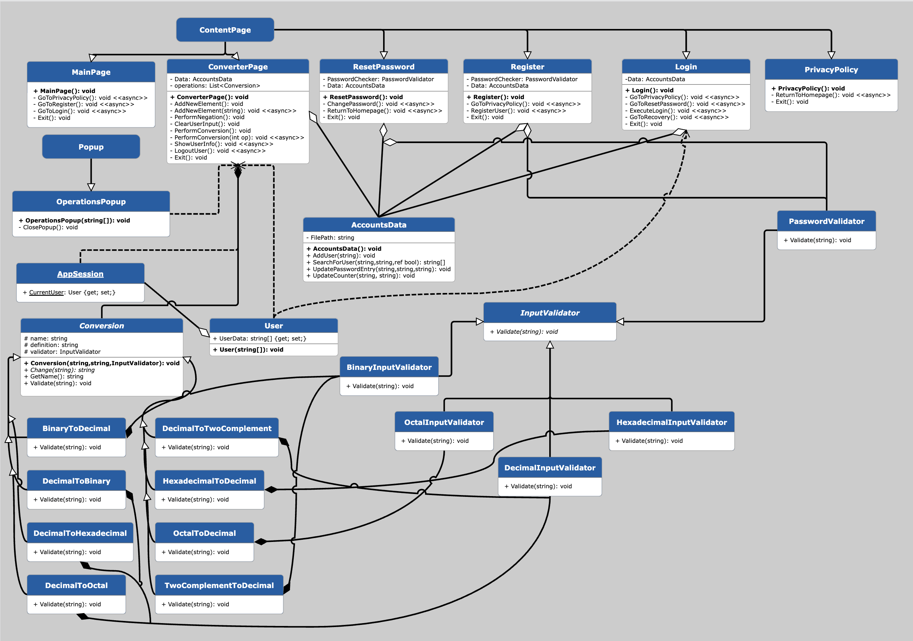

# Practical Work II OOP

## Cover
Practical Work 2 - Aleksandr Zapparov

## Table of Contents
1. <a href="#1-introduction">Introduction</a>
2. <a href="#2-description">Description</a>
3. <a href="#3-problems">Problems</a>
4. <a href="#4-conclusions">Conclusion</a>

## 1. Introduction
This DDD document presents a detailed documentation on the App, covering the pages it has, the distinct modifications that were made for the final product, and details the issues and conclusions on the project itself.

## 2. Description
Here is the UML Diagram for my Project (Multiplexities were not included because it was honestly too much work):

This project is composed of the following pages listed:

### MainPage
It is the homepage of the App, and it has two buttons that redirect you to Login and Register Pages.

### Privacy Policy
Just an empty page, since it was required in the guidelines.

### Register
Page made for the creation of the User. Beforehand, on entrance to Register Page, the path where account data will be stored is already created.
To check where exactly it was stored, you can run the commented out code and using your file explorer, find the csv document by absolute path.
In case there is no comment or it was deleted, here is the code you should introduce in AddUser in AccountsData class to check where the user was added to:
```
string fullPath = Path.GetFullPath(filePath);
await DisplayAlert("Path", Path.GetFullPath(filePath), "OK");
```
This will get the full absolute path of where the file was stored, and will then display it using an Alert. The absolute path is the Alert's Message.

It is recommended to run this in the RegisterUser Method because it is easy to verify if both user and file have been created properly.

### Login
Page where the user, after registering, will input their username and password to access the Converter.

The page also has an additional page for resetting the password in case you forgot it. This can be accessed by the blue text "Forgot Password?"

### Reset Password
Page where the user can ask for resetting their password. For the process to be successful, you need to provide both your username and email. Only when both are correct, are you allowed to change your password.

After completion, you will be redirected back to the Login Page.

### ConverterPage
This page is the most complex. It has user input using the keypad on the left for numbers 0-9 and letters A-F along with AC (Clear Input) and - (Negate Number).

The right side of the keypad is for different types of operations. When an operation is pressed, a display alert will appear showing the input and output of your operation and the type of operation you executed. 

This page also introduces some additional features such as the Operations tab and Logout tab in the Navigation. 

When Operations is pressed, a popup will appear displaying the user's information along with the user's operations count as required by the guidelines. This count is also incremented on every operation executed. 

When Logout is pressed, the current user session is stopped (Additional Details will be explained in the next section), and the user is returned back to the homepage of the application.

### Additional Considerations
In the process of creating the pages and their operations, I realised there was a need for additional classes to manage the complexities of the both user data, and managing what user is using the application at that moment.

These are the classes I created to meet my requirements for my App:
- **AppSession:** This is a static class. The reason I made it a static class is because I wanted to access it without having to initialise it. This class is used to access the current User information and keeping track of whether there is a current user using it or not (if not, then it is kept empty).
- **User:** This static class was for both creation and logging out of the user. This class was mainly to store the current user's data, which would be accessed via AppSession when required in the program.
- **AccountsData:** By far the most essential class. This class I created midway in the project as I realised I was writing and reading the accounts.csv file more than I expected, so I created this class to globalise any sort of features I needed, such as Adding and Finding a User in the file and updating both password and operations count. I would say this class, with ConverterPage are the most complicated.

Additionally, I created a new validator using the already existing InputValidator abstract class for password validation (PasswordValidator Class).

Lastly, all pages have in their navigation a Exit tab. This is to fully terminate the runtime execution. 

## 3. Problems
I did not have that many issues when it comes to creating this project, the hardest was the planning out for different features. The hardest feature to implement was the popup for the converter page. I misread the instructions, and thought you actually had to make a popup, but from the image it was actually just a separate page, which would've made things much easier. However after some searching up around, and tinkering with my popup, I managed to make it work, and now when you click on Operations in the Converter Page, a Popup pops up, showing all the user information. For all things account storing and using their data, I also had to think up of what to use, and after noticing that I was accessing the file too many times from many places, I just globalised both current user that is using the converter, and the class that is accessing the document and modifying it when needed.

The funniest error I had was when I was updating the operations total count, and when I did that previously, it also replaced a number in the password, so I changed both password a little and the counter, which did confuse me for a bit.

However, overall, this project out of all was one that required the most time investment compared to any other project I've done in University so far.

## 4. Conclusions
This project aimed for us to advance our skills in the usage of Maui and understanding its connection with the C# language. 

It aimed at helping us figure out how to organize an application by classes, but also the development of soft skills like self learning and applying existing knowledge to a new problem or puzzle (as I call any programming task).

Unlike the guided works, or any other project for that matter, we only had what the assignment wanted from us, which is why this also allowed us to learn the capability to think critically and evaluate possible issues such as unexpected input from the user, or organization of code.

For me, this helped me overall increase my skill when it comes to finding the right knowledge and applying said knowledge in my work, while providing the best possible work from me.
